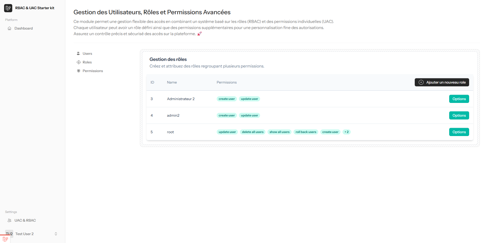

# Laravel RBAC & UAC Starter Kit with Livewire 3

## Introduction

This Laravel Starter Kit offers a solid foundation for building secure and scalable applications. It integrates **Role-Based Access Control (RBAC)** and **User Access Control (UAC)**, allowing users to have multiple roles and permissions. The permissions are managed using the popular **Spatie Laravel Permissions** package. The kit also comes with essential tools such as **Log Viewer** and **Debug Bar**, built on **Livewire 3** for creating dynamic, real-time UI components without writing custom JavaScript. 

Additionally, the starter kit comes with a **beautiful and intuitive UI** for managing users, roles, and permissions with ease.



## Features

- **RBAC & UAC Integration**: Users can have multiple roles and permissions, allowing flexible user management.
- **Permissions Management**: Assign fine-grained permissions to roles and users using **Laravel Spatie Permissions**.
- **Beautiful UI for User Management**: A visually appealing and easy-to-use interface to manage users, roles, and permissions.
- **Log Viewer**: Convenient interface to view application logs.
- **Debug Bar**: Provides real-time insights into debugging and application performance.
- **Livewire 3 Integration**: Real-time, dynamic UI without custom JavaScript, making it highly interactive.
- **Pre-configured Authentication**: Includes Laravel Breeze or Jetstream (if applicable) for easy user authentication.
- **Seamless Role and Permission Assignment**: Easily assign roles and permissions to users using the built-in UI and Artisan commands.

## Installation

### Prerequisites

Ensure you have the following installed:

- PHP 8.1+
- Composer
- Laravel 11+
- MySQL/PostgreSQL/SQLite

### Installation Steps

1. Clone the repository
2. Install dependencies:
   ```bash
   composer install
   ```

3. Copy the `.env` file and configure your database settings:
   ```bash
   cp .env.example .env
   ```
   Update your database credentials in `.env`.

4. Generate the application key:
   ```bash
   php artisan key:generate
   ```

5. Run migrations and seed the roles & permissions:
   ```bash
   php artisan migrate --seed
   ```

6. Serve the application:
   ```bash
   php artisan serve
   ```

## Usage

### Managing Roles & Permissions

This starter kit uses **Spatie Laravel Permissions** to manage roles and permissions. You can easily assign roles and permissions through the UI or use the built-in Artisan commands:

- **Create a role**:
  ```bash
  php artisan role:create "Admin"
  ```

- **Assign a role to a user**:
  ```bash
  php artisan user:assign-role user@example.com "Admin"
  ```

- **Assign a permission to a role**:
  ```bash
  php artisan permission:assign "manage-users" "Admin"
  ```

### User Management UI

The user management UI is beautiful and user-friendly. It allows you to:

- **View** all users along with their assigned roles and permissions.
- **Add/Edit/Delete users** and easily manage their roles.
- **Assign roles** to users via an intuitive dropdown.
- **Edit permissions** for specific roles.

This UI is built with **Livewire 3**, providing a seamless, real-time experience.

### Log Viewer

Access application logs directly through the **Log Viewer** interface available in the app, allowing you to view, filter, and search logs easily.

### Debug Bar

Use the **Debug Bar** in the development environment for real-time performance monitoring, debugging, and insights into application queries, views, and more.

## Contributing

We welcome contributions! Feel free to fork the repository, make improvements, and submit pull requests. If you encounter any issues or have suggestions, please open an issue in the repository.

## License

This project is licensed under the MIT License.

## Author

Developed by [Mebrouki Mohamed El Amine](https://github.com/da-production).

---

